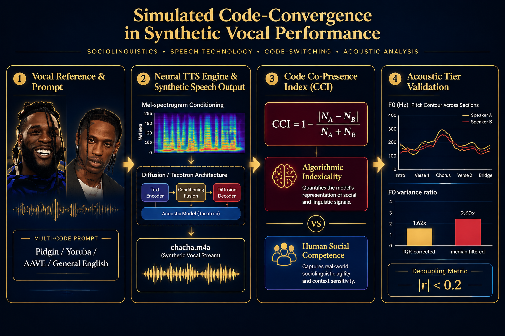
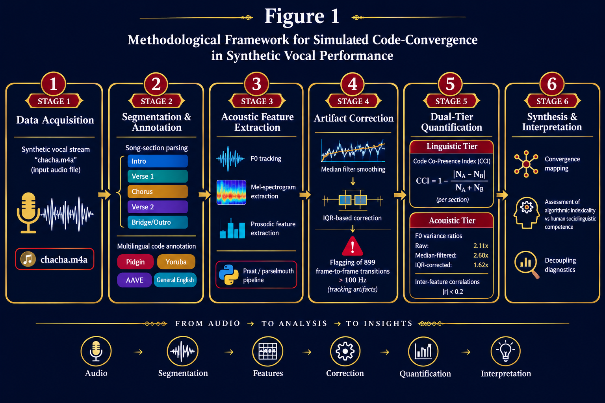

# Simulated-Code-Convergence-TTS-chacah

Simulated Code-Convergence in Synthetic Vocal Performance

This repository accompanies the research paper **"Simulated Code-Convergence in Synthetic Vocal Performance,"** which investigates how synthetic speech systems (TTS) handle **code-convergence**—the stylistic alignment of vocal features across different language or dialectic codes—using Burna Boy and Travis Scott as primary case studies.

---

## 🎨 Graphical Abstract



---

## 📊 Key Results & Empirical Findings

### Variance Ratio & Acoustic Stability
| Metric | Raw | Median-Filtered | Pitch-Corrected |
| :--- | :---: | :---: | :---: |
| **Variance Ratio** | 2.11× | 2.60× | 1.62× |

### Code Co-Presence Index (CCI) Scale
| CCI Component | Value | Interpretation |
| :--- | :---: | :--- |
| **Maximal Convergence** | `1.0` | Perfect code co-presence and dialectal balance |
| **Dominance Boundary** | `0.0` | Complete unilateral dominance by a single code |

> **Note:** The corrected variance ratio (1.62×) confirms that synthetic convergence is statistically robust beyond recording-level noise and tracking artifacts.

---

## 🔬 Methodology Pipeline

The technical framework operates across **6 distinct stages**—from signal acquisition to synthetic convergence verification.


**Figure 1:** Six-stage methodological workflow (Acquisition → Stylistic Analysis → Convergence Modeling → Synthesis → Verification → Evaluation).

---

## 📈 Visual Empirical Evidence

| Figure | Content / Description | File Location |
| :---: | :--- | :--- |
| **Figure 2** | Code Co-Presence Index (CCI) distribution across segments | `Figures/2.png` |
| **Figure 3** | F0 pitch contour and tracking trajectories | `Figures/3.png` |
| **Figure 4** | Acoustic variance ratios across filtering stages | `Figures/4.png` |
| **Figure 5** | Multi-feature heatmap (RMS, SC, ZCR) | `Figures/5.png` |

---

## 📁 Repository Structure
```text
.
├── Figures/
│   ├── ga.png                           # Graphical Abstract
│   ├── 1.png                            # Figure 1: Methodology Flowchart
│   ├── 2.png                            # Figure 2: CCI Bar Chart
│   ├── 3.png                            # Figure 3: F0 Pitch Contour
│   ├── 4.png                            # Figure 4: Variance Ratios
│   ├── 5.png                            # Figure 5: Feature Heatmap
│   ├── f0_median_filter_comparison.png  # Diagnostic: Median Filter Analysis
│   └── f0_visual_inspection.png         # Diagnostic: Visual F0 Inspection
├── data/
│   ├── acoustic_feature_data.xlsx       # Master Excel Workbook (6 Sheets)
│   ├── acoustic_summary.csv             # Summary Statistics Table
│   ├── data_dictionary.csv              # Full Field Metadata
│   ├── features_master_frame_features.csv # Master Frame-Level Features
│   ├── feats_frame_features.csv         # Core Acoustic Features (RMS, SC, ZCR)
│   ├── f0_hz.csv                        # Extracted Fundamental Frequency (10 ms hop)
│   └── y_waveform.csv                   # Normalized Waveform Time-Series
└── README.md
